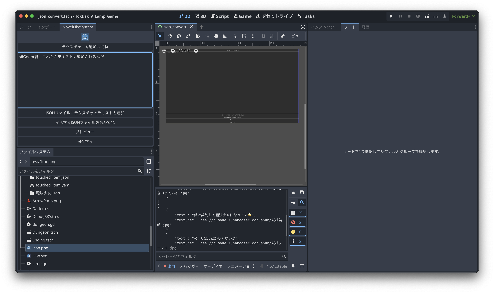

# 概要

読み込んだテクスチャーとテキストの内容を一つの辞書型にまとめて配列に格納し、JSONに変換して保存するアドオンです。

このようなJSONファイルになります。

```json
[
    {
        "texture": "res://path/to/texture.png",
        "text" : "どうも、Godotアドオンです。"
    },
    {
        "texture": "res://path/to/another_texture.png",
        "text" : "複数のテクスチャーとテキストをまとめて保存できます。"
    }
]
```

# 使い方

プラグインを有効化した後、左側のタブにNovelLikeSystemというものができていると思うのでそこから編集を開始できます。


1. テクスチャーと書かれたボタンを押すとファイル選択ダイアログが開くため、画像ファイルを選択します。
2. テキストエリアにはテキストを入力してください。



このようになったら「JSONファイルにテクスチャとテキストを追加」をクリックしてください。

テクスチャとテキストが消えますがそれで追加されたことになります。

保存するボタンでJSONファイルとして名前をつけて保存できます。
